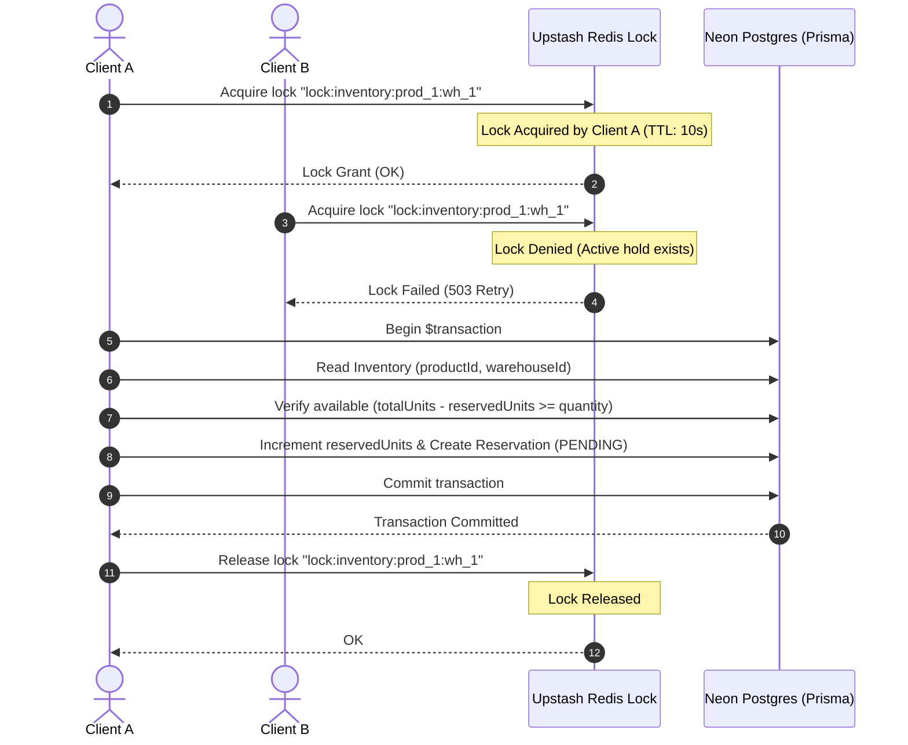

# Allo Inventory: Race-Condition Safe Reservation System

A concurrency-safe, high-performance product inventory reservation system built on Next.js 16 (App Router), Neon Postgres (Prisma ORM), and Upstash Redis. It prevents stock over-allocation (overselling) under high concurrent demand.

---

## 🚀 Getting Started

### 1. Environment Variables
Create a `.env` file in the project root with the following variables:

```bash
# Database connection (Neon PostgreSQL Serverless)
DATABASE_URL="postgresql://<user>:<password>@<host>/<database>?sslmode=require"

# Distributed locking cache (Upstash Redis)
UPSTASH_REDIS_REST_URL="https://<endpoint>.upstash.io"
UPSTASH_REDIS_REST_TOKEN="<token>"

# Webhook protection token for Vercel Cron jobs
CRON_SECRET="your-random-cron-secret-token"
```

### 2. Database Migration
Deploy the schema tables to your database instance:
```bash
npx prisma migrate dev --name init_schema
```

### 3. Seed Database
Initialize the database with sample products, warehouses, and low stock units (between 2 and 5) to facilitate concurrency testing:
```bash
npx prisma db seed
```

### 4. Run Development Server
```bash
npm run dev
```
Open [http://localhost:3000](http://localhost:3000) to view the application.

---

## 🏛️ Architecture Overview

The system is organized into modular layers ensuring separation of concerns:

- **Frontend UI (Next.js 16 Client Components)**: 
  - `/products`: Live stock listing with real-time badges and independent Reserve buttons per warehouse.
  - `/reservation/[id]`: A checkout page featuring a reactive, live `mm:ss` countdown timer, cancel handler, and final confirm controls.
- **Next.js App Router (HTTP Endpoint APIs)**:
  - Exposes RESTful endpoints for querying products and managing the lifecycle of reservations (creation, confirmation, and release).
- **Core Services (`src/lib/`)**:
  - `reservation.ts`: Main creation service implementing distributed locks and transactional writes.
  - `cleanup.ts`: Service tasked with purging expired pending holds and returning stock.
- **Persistence & Cache Layer**:
  - **Neon Serverless Postgres**: Highly available relational storage.
  - **Prisma ORM 7**: Safe schema generation, migrations, and transactional client interfaces.
  - **Upstash Redis**: Used as a low-latency distributed lock registry.

---

## 🔒 Concurrency & Race-Condition Prevention

### Why We Need Both: The Lock + Transaction Duality
Under heavy concurrent traffic (e.g., thousands of clients attempting to reserve the same last unit of stock), typical database transactions alone or simple cache counters fail.

#### Scenario 1: Prisma Transaction Only (Read Committed Default Isolation)
1. User A and User B concurrently execute a transaction to reserve a unit.
2. Both read the same database row: `reservedUnits = 2`, `totalUnits = 3` (available stock is `1`).
3. Both processes compute `available = 1 > 0` as valid, proceed to update `reservedUnits = 3`, and successfully insert two separate reservations.
4. **Result**: Stock is over-allocated, and the store has oversold (4 reservations exist for 3 units).

#### Scenario 2: Redis Lock Only (No Transaction)
1. Process acquires a distributed lock, confirming stock availability in the application cache.
2. It attempts to update the database, but the database connection times out or fails.
3. The process crashes before releasing the lock or writing changes.
4. **Result**: The database state is out of sync, or the lock keys remain stuck without a matching db persistence.

### The Solution: Combined Lock and Transaction
Allo Inventory employs a **pessimistic distributed lock** coupled with a **database transaction** to enforce mutual exclusion and data consistency.



1. **Mutual Exclusion (Redis Lock)**: Serializes entry to the critical inventory logic. Only one request per `productId` and `warehouseId` combination can execute at any instant.
2. **State Atomicity (Prisma Transaction)**: Protects against system failures midway through execution. Either both the inventory update and reservation creation succeed, or the system rolls back cleanly.
3. **Guaranteed Cleanup**: Leverages a strict `try-finally` block to ensure the Redis lock is **always released**, even if the database transaction fails.

---

## ⏳ Reservation Expiry & Stock Restitution

Pending reservations hold stock for exactly **10 minutes**. To prevent inventory from being locked forever by abandoned carts, the system implements a **dual-expiry recovery pipeline**:

### 1. Lazy Cleanup (Just-In-Time)
Before a user reads product lists at `GET /api/products`, the server fires a database transaction that locates expired `PENDING` holds, marks them `EXPIRED`, and decrements the corresponding inventories' `reservedUnits`. This ensures clients always see **100% accurate, up-to-date availability**.

### 2. Active Scheduled Cleanup (Vercel Cron)
To ensure stock is systematically freed up even during periods of low read traffic, a Cron scheduler runs periodically.
- **Interval**: Configured in `vercel.json` to fire every minute (`* * * * *`).
- **Endpoint**: `/api/cron/release-expired`
- **Security**: The cron route requires `Authorization: Bearer ${process.env.CRON_SECRET}` to prevent malicious external execution.

---

## 🚦 HTTP Status Code Reference

| Status Code | Meaning | Context of Usage in Allo Inventory |
| :--- | :--- | :--- |
| **`201 Created`** | Created | Returned when a reservation is successfully created (stock is secured). |
| **`200 OK`** | Success | Returned on successful reads, purchase confirmations, and user cancellations. |
| **`400 Bad Request`** | Validation Error | Sent when payload validation (Zod) fails or illegal status transitions are requested. |
| **`404 Not Found`** | Resource Missing | Sent if a product, warehouse, or reservation ID does not exist in the database. |
| **`409 Conflict`** | Out of Stock | Sent during reservation creation if available stock has dropped to zero. |
| **`410 Gone`** | Expiry | Returned during purchase checkout if the pending reservation holds have expired. |
| **`503 Service Unavailable`** | Lock Conflict | Returned if the request fails to acquire the Redis lock due to high concurrent threads. |
| **`500 Internal Error`** | Unhandled Error | Caught by global catch-blocks to hide database internals and return a safe generic message. |

---

## ⚖️ Trade-offs Made

1. **Network Latency (Redis + DB)**: Acquiring a distributed lock requires an extra network round-trip to Upstash Redis. For highly geo-distributed configurations, this adds slight millisecond overhead per request in exchange for absolute safety.
2. **Pessimistic Locking vs. Optimistic Versioning**: We chose pessimistic locking because stock reservations represent highly competitive write operations. While optimistic locking has lower latency, it leads to high rates of transaction failures and user retries during high-concurrency spikes.

---

## 📈 Future Optimizations (With More Time)

1. **Idempotency Keys**: Incorporate unique client-generated headers (e.g., `Idempotency-Key: <UUID>`) on `POST /api/reservations` to prevent double-charging or duplicate reservations on network retries.
2. **WebSockets for Live Stock Updates**: Push real-time inventory counts and state changes to active product catalogs via WebSockets (or Server-Sent Events) rather than relying on manual page refreshes or short-polling.
3. **Queue-Based Expiry (Redis Keyspace Notifications)**: Transition from polling schedules to reactive queues. By listening to Redis key expiration events, we can trigger stock recovery operations the exact second a reservation window times out.
